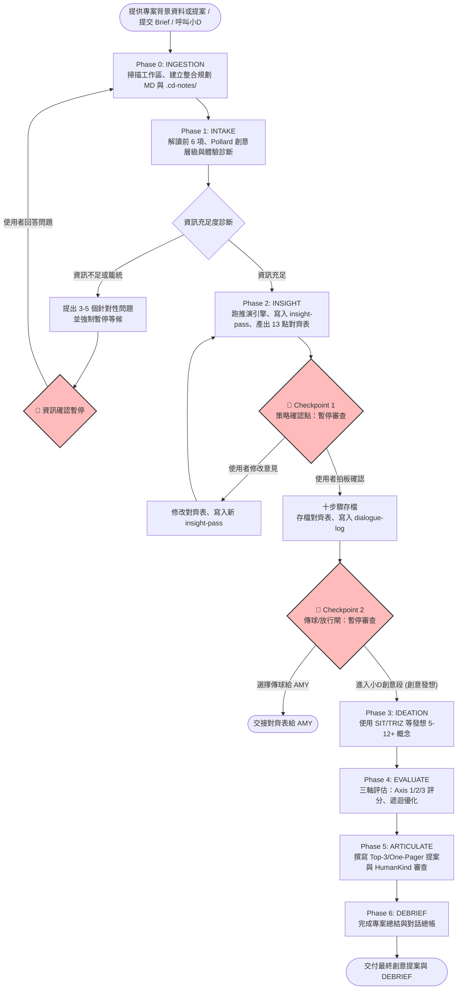

# 🗺️ Creative Director (小D) 執行流程圖 (Flow Diagram)

本文件描述 `creative-director` (小D) 技能升級至 v1.4.0 之後的完整工作流，展示了策略段（Phase 0-2）與創意段（Phase 3-6）的兩段式架構，以及三個核心的 Checkpoint 人工介入閘門。

---

## 📌 核心流程圖 (Mermaid)

*(註：交給 AMY 之後的社群分流 A/B/C 三分支目前尚未實作，涉及跨技能協作)*

---

## 🔄 流程與階段說明

### 🟢 第一階段：策略段 (Strategy Segment)
本段聚焦於「洞察挖掘」，在沒有明確的洞察與策略定位前，嚴禁進行任何創意發想。

1. **Phase 0: INGESTION (導入與建檔)**
   * 掃描與定位工作區內的 `專案資料區/`，引導使用者選擇或建立新案。
   * 自動整合 Brief 資訊，於專案目錄建立 `[YYYY-MM-DD]_[案名]整合規劃.md`，並靜默建立 `.cd-notes/` 隱藏資料夾。
2. **Phase 1: INTAKE (解讀與診斷)**
   * 萃取**對齊表**前 6 項（包含 Pollard 7層創意層級定位）。
   * 執行**資訊充足度診斷**。若發現關鍵欄位不足或流於空泛，強制暫停並提出 3-5 個白話問題（進入臨時資訊確認點）。
3. **Phase 2: INSIGHT (洞察挖掘與對齊)**
   * 套用 Mark Pollard 四點法、JTBD、張力挖掘等工具，並在後台使用品牌原型、角色鑑定、空雨傘引擎，將推演痕跡寫入 `insight-pass-0N.md`。
   * 輸出 **13 點策略對齊整合表**（使用商務白話轉譯，隱藏後台框架術語）。
   * **Checkpoint 1 (策略確認點)**：輸出**對齊表**後強制暫停，等待使用者確認或修改。
   * **存檔結案**：收到確認後，存檔 `[YYYY-MM-DD]_[案名]_策略對齊表.md` 並寫入週期總帳 `dialogue-log-0N.md`。
   * **Checkpoint 2 (放行點/傳球門檻)**：策略段結案後強制暫停。必須取得人類指令以決定「傳球給 AMY 撰寫社群講稿（傳球後續的社群分流 A/B/C 三分支目前尚未實作）」或「放行進入小D創意段」。

---

### 🎨 第二階段：創意段 (Creative Segment)
需策略段確認通過、且取得 Checkpoint 2 放行指令後方可解鎖進入。

1. **Phase 3: IDEATION (創意發想)**
   * **對標經典案例 (MOC Scan)**：發想前需載入經典案例庫索引，隨機或針對性瀏覽 5-7 個坎城/D&AD 經典 Campaign，避免重疊舊套路並尋找市場盲區（Gap Borrowing）。
   * **三方法矩陣發想 (Method Selection Matrix)**：從小D 創意方法矩陣中，強制挑選三種不同類型的工具（1. 結構型 SIT/TRIZ/SCAMPER ➔ 2. 聯想型 雙向聯想/強迫連結 ➔ 3. 逆向/干擾型 逆向腦力激盪/奧比列克指示），發想並產出 8-12 個概念。
   * **常規暖身過濾 (Conventional Warmup)**：將前三個最直覺的想法標記為「常規暖身」，不予採用，刻意聚焦於第 5 至 12 個以上更具原創性的深度概念。
   * **張力測試與 SMP 結晶**：對每個概念進行「文化/品類/人性」張力測試，若無衝突張力則原創性降級。每個創意概念最終以「一句話 SMP 主張 + 2-3 行具體發展說明」呈現。
2. **Phase 4: EVALUATE (三軸評估與優化)**
   * **創意位階對齊 (Idea Level Check)**：檢查創意是否對齊 Phase 1 要求的 Pollard 7層分類（如企業/品牌/活動/非廣告體驗/執行手段），防止用單一執行手段（如做個濾鏡、辦個抽獎）偽裝成 Campaign 平台。
   * **三軸評估系統 (Three-axis evaluation)**：
     * **Axis 1: Brief 合規篩選 (8題 Pass/Fail)**：包含簡說度、目標回應、洞察契合、TA 適配、產品支撐等，任何一題 Fail 則直接淘汰。
     * **Axis 2: 六指標加權評分 (原創、契合、情感、可行、延展、簡單)**：
       * *原創性校準*：若對標經典案例庫中該模式已有 3 個以上案例，原創性分數上限鎖死在 6-7 分。
       * *情感共鳴校準*：打中第 1 層基礎情緒上限 6 分，第 2 層特定情緒 6-8 分，打中第 3 層複雜情緒（如諷刺的真誠、含淚的自豪）才可得 9-10 分。
       * *HumanKind 評估*：結合 Cannes 規格做整體評分（低於 7 分禁止輸出）。
     * **Axis 3: 系統延展性檢查 (4題簡答)**：評估生命週期長度、抽象層級上下抽換能力、跨管道部署力、以及執行間的系統化程度。
   * **四視角評審與遞迴收斂 (Multi-perspective Panel)**：模擬創意總監、策略師、消費者與坎城評審四個視角進行自我質疑與缺口分析（Gap Analysis），並重複遞迴優化，直至綜合分數達到 9 分以上（且寫入評估日誌留痕）。
3. **Phase 5: ARTICULATE (提案包裝)**
   * 將最終收斂的 Top-3 概念包裝成 One-Pager 或 Campaign Platform 提案格式，並執行 HumanKind 最終審查。
4. **Phase 6: DEBRIEF (專案總結)**
   * 產出 DEBRIEF 總結報告，並結算完整的 `dialogue-log-0N.md` dialogue 總帳，正式結案。
